# Advanced Lane Finding
[](http://www.udacity.com/drive)

The goal of this project is, given a video of a road taken from a car moving forward, to identify the lane lines and plot them on the video.

Here is a glimpse of the what we have accomplished in this project -

<p float="left">
    
    
</p>

&nbsp;

The work is done in the following jupyter notebook: [advanced_lane_lines.ipynb](advanced_lane_lines.ipynb)

The results of applying the image processing pipeline on the test images are here: [data/output_images/](data/output_images/)

The final result(plotted lanes on the project-video) can be found here: [data/output_videos/challenge_video_solution.mp4](data/output_videos/project_video_solution.mp4)


* Compute the camera calibration matrix and distortion coefficients given a set of chessboard images.
* Apply a distortion correction to raw images.
* Use color transforms, gradients, etc., to create a thresholded binary image.
* Apply a perspective transform to rectify binary image ("birds-eye view").
* Detect lane pixels and fit to find the lane boundary.
* Determine the curvature of the lane and vehicle position with respect to center.
* Warp the detected lane boundaries back onto the original image.
* Output visual display of the lane boundaries and numerical estimation of lane curvature and vehicle position.


## Camera Calibration

#### 1. Briefly state how you computed the camera matrix and distortion coefficients. Provide an example of a distortion corrected calibration image.

The camera calibration matrix and the distortion correction coefficients are in the **Camera Calibration** section of the [advanced_lane_lines.ipynb](advanced_lane_lines.ipynb) Jupyter Notebook.

The goal is this part is to use known images to device a mapping function between distorted and undistorted images that when applied to other distorted images corrects the distortion. Images of chessboards are ideal candidates for this task as layout of chessboards is very mathematically structured and hence the corners on undistorted images are deterministic to some degree.

I read the given 20 distorted images of chessboards. Using the ```cv2.findChessboardCorners ``` function I tried to locate the corners of the chessboard and then using the ```cv2.drawChessboardCorners``` function I plotted the corners on the respective images. Corners were found for most of the images and for some of them, I could not find any corners such as for calibration4.jpg, calibration5.jpg etc. For the images where corners were found, the image-points(corners) were stored in an array named ```imgpoint``` which is an 2D array of image points as the given images are in 2D. The known corners of the undistorted chessboards, called the object points, are stored in a 3D array named ```objpoint```. We need 3D array for object points as we are trying to correct for distortion of 3D objects projected into 2D images. As chessboards the flat, the 3rd co-ordinate in ```objpoint``` is always kept at 0.

After that, I used the ```cv2.calibrateCamera``` function on the image points and the object points to calculate the camera matrix and the distortion coefficients, which are then used to get the undistorted image using the ```cv2.undistort``` function.

```python
ret, mtx, dist, rvecs, tvecs = cv2.calibrateCamera(objpoints, imgpoints, image_size, None, None)
dst = cv2.undistort(image, mtx, dist, None, mtx)
```
Here is the result of undistorting one chessboard image as test:

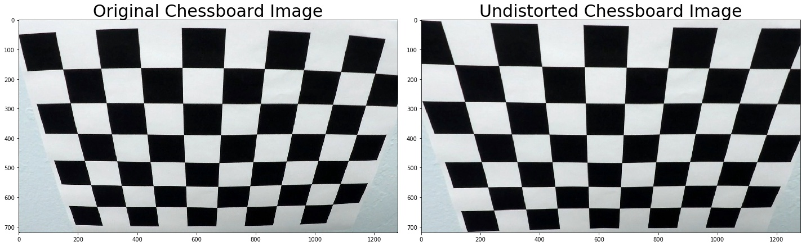

I have saved the camera calibration results [here](data/camera_calibration.p) for later uses. 


## Pipeline (single images)

### 1. Distortion Correction

Using the camera calibration matrix and distortion coefficients that I had saved in the previous step, I write a function called ```undistort_image``` that, given a distorted image, performs undistortion and returns a corrected image. Here is an example: 

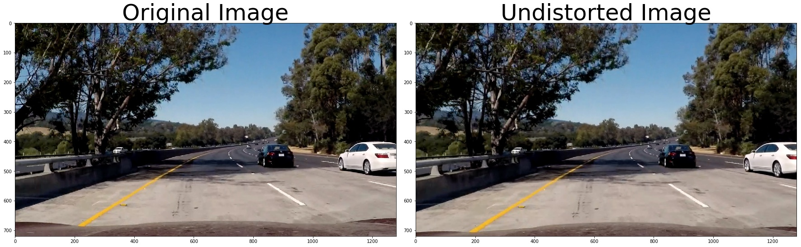

### 2. Thresholding into a Binary Image: Color transforms, Gradients or other methods

To get the binary image that would aid in isolating the lane lines in the images of the road, I wrote several functions to implement different thresholding methods to get binary images:

* **Absolute Sobel Thresholding**: I wrote the ```abs_sobel_thresh``` function that implements  the [Sobel operator](https://en.wikipedia.org/wiki/Sobel_operator) to detect absolute changes in gradients along the X and Y axes in order to detect lines.

* **Magnitude Thresholding**: I implemented the ```mag_thresh``` function to implement a thresholding by taking the Euclidean magnitude of the gradients as measured by the Sobel method along X and Y axes.

* **Direction Thresholding**: To get thresholding with respect to the direction of the gradients identified by the Sobel methods, I wrote the ```dir_thresh``` function which works by measuring the angle (arctan) between Sobel operators in X and Y directions.

* **Color Space Thresholding**: To detect changes in the HLS color space of the images in order to detect lines, I impelemented the function ```hue_thresh``` and ```saturation thresh``` to detect changes in hue and saturation of images.


##### Combining all thresholds:
Each of the thresholding techniques mentioned above detect some facets of the lines. To get a comprehensive binary image so that our downstream work of fitting mathematical equations to the lane lines becoms easier, I combined the individual methods in a function named ```combined_thresh```. Here is how they are combined:

```python
def combined_thresh(img, abs_thresh = (20, 100), magnitude_thresh = (30, 100), \
                         angle_thresh = (0.7, 1.4), h_thresh = (10, 35), s_thresh = (120, 255)):
    
    gradx = abs_sobel_thresh(img, orient = 'x', sobel_kernel = 3, thresh = abs_thresh)
    grady = abs_sobel_thresh(img, orient = 'y', sobel_kernel = 3, thresh = abs_thresh)
    mag_binary = mag_thresh(img, sobel_kernel = 3, thresh = magnitude_thresh)
    dir_binary = dir_thresh(img, sobel_kernel = 3, thresh = angle_thresh)
    h_binary = hue_thresh(img, thresh = h_thresh)
    s_binary = saturation_thresh(img, thresh = s_thresh)
    combined_binary = np.zeros_like(gradx)
    combined_binary[(gradx == 1) & (grady ==1) & (mag_binary == 1) & (dir_binary == 1) | (h_binary == 1) & (s_binary == 1)] = 1
    return combined_binary
```

Below is a glimpse of how the different thresholds look when applied to one of the images of the road.

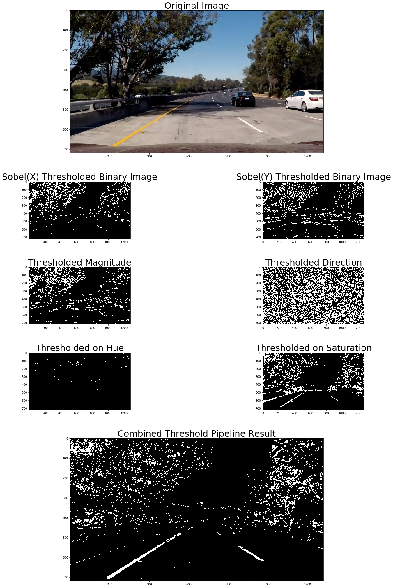

### 3. Perspective Transformation and Warping

I implemented perspective transformation and warping by writing a function named ```perspective_transform``` which takes in an image and first performs perspective transformation by using the ```cv2.getPerspectiveTransform``` function when given one source and a destination. Then it warps the image using the ```cv2.warpPerspective``` function and returns a warped image and two matrices ```M``` and ```Minv```.

Here is an example of how it works.

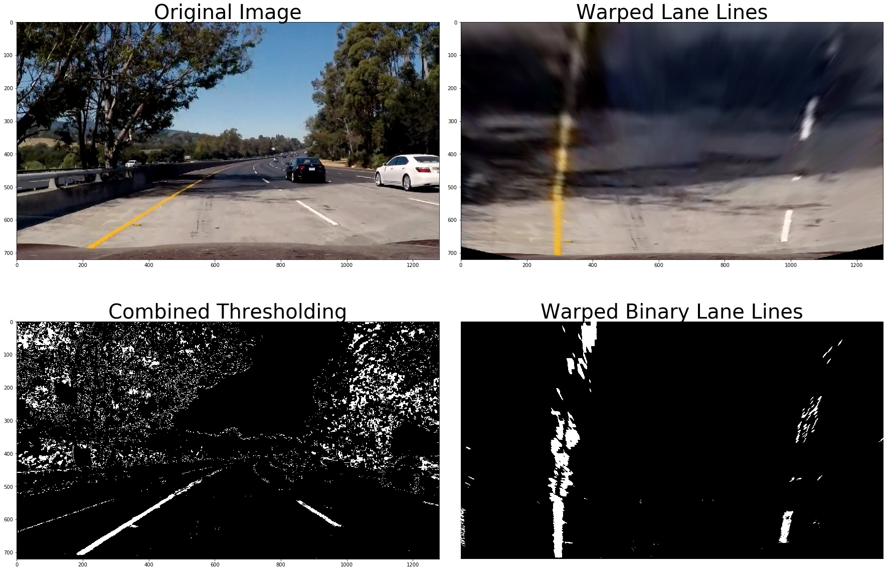

### 4. Lane Lines Detection and Polynomial Fitting
I used two methods for lane lines detection and to fit polynomials.

#### a) Sliding Windows Method:
Given a binary image that has gone through perspective transform and warping, this method (implemented in functions ```find_lane_pixels``` and ```get_polynomial```) divides the image into several horizontal windows and then detects peaks in intensity on the left and right side of frame. To do this, intensity histograms are taken into account. When all the peaks have been detected, ```np.polyfit``` is used to fit a quadratic equation to each side of the image to represent the left and the right lanes. The result of this process looks like this when applied to a test image.

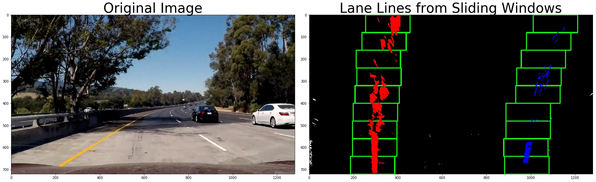


#### b) Search From Prior Method:
I implemented the ```search_around_poly``` function which, gievn an image of a road and equations of lines from the left and the right lanes from the previous frame, tries to detect and fit lane lines in the current frame. It does so by reading the previous lane lines and then looking for lines within their margins. The working principle of this method is that when the camera takes images in a moving car, there is very high chance of finding the next lines around the neighborhood of the previous lines as lane lines do not change abruptly. 

Here is an example:
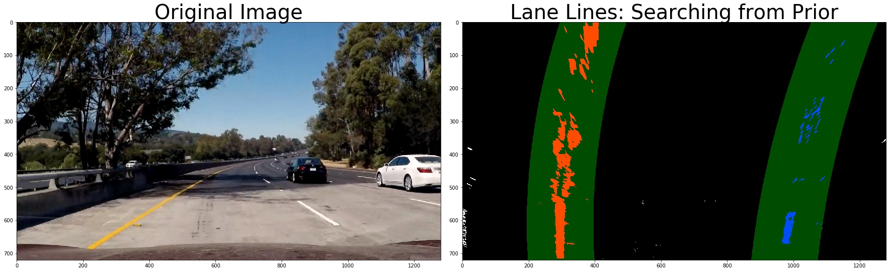


### 5. Measuring Curvature and Distance from the Center
There were two methods taught in the course to calculate curvature of the lines and I implemented both in my notebook. They are named ```measure_curvature_and_center``` and ```curvature_in_meters``` respectively. I used the second one, ```curvature_in_meters```, to implement in the pipeline. Once the left and right radii of curvature have been determined, I use take average of their intercepts at the bottom of the image to detect the center of the car and then subtract from the middle of the width of the image to get the distance from the center.

I also wrote a function ```print_data_on_image``` that prints the two radii and the distance of the center on the image.

### 6. Pipeline

I wrote a python class for the lines in order to help me keep track of lanes from previous frames. It is called ```class Line()```. The entire pipeline is implemented in the function ```pipeline```

Here is how my pipeline works - 
* Initialize two lines 
    ```python
    left_line ,right_line = Line(), Line()
    ```
* Read the image and undistort it
    ```python
    undistorted = undistort_image(image, dist_pickle)
    ```
    
* Get a binary image by applying different thresholding techniques on the undistorted image
    ```python
    thresholded = combined_thresh(undistorted)
    ```
* Apply perspective transform
    ```python
    binary_warped, Minv, M = perspective_transform(thresholded)
    ```
* If lanes are not detected in the previous frame, use sliding windows to detect lines in the current frame
    ```python
    if left_line.found == False or right_line.found == False:
        lanes_detected, left_fit, right_fit = fit_polynomial(binary_warped)
    ```
* Else if lanes are detected in the previous frame, use them to detect lines in the current frame
    ```python
    else:
        lanes_detected, left_fit, right_fit = search_around_poly(binary_warped, left_line.previous_fit, right_line.previous_fit)
    ```
        
* Plot the lines on the original image
    ```python
    plotted_lane = draw_lines_on_image(image, binary_warped, left_fit, right_fit, Minv)
    ```
* Print the curvature radii and distance from the center on the image 
    ```python
    left_curverad, right_curverad, dist_from_center = curvature_in_meters(binary_warped, left_fit, right_fit)
    printed_data_on_image = print_data_on_image(plotted_lane, left_curverad, right_curverad, dist_from_center)
    ```

* Save the fitted lines for the next frame
    ```python
    left_line.previous_fit, right_line.previous_fit = left_fit, right_fit
    left_line.found, right_line.found = True, True
    ```
    
* return the plotted lane


### Pipeline on all test images

### result: test1    
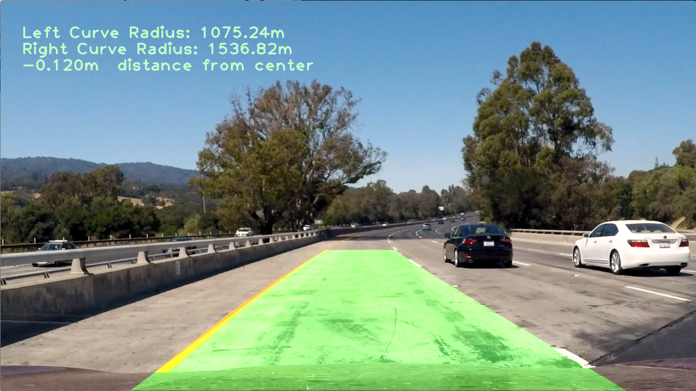

&nbsp;
### result: test2
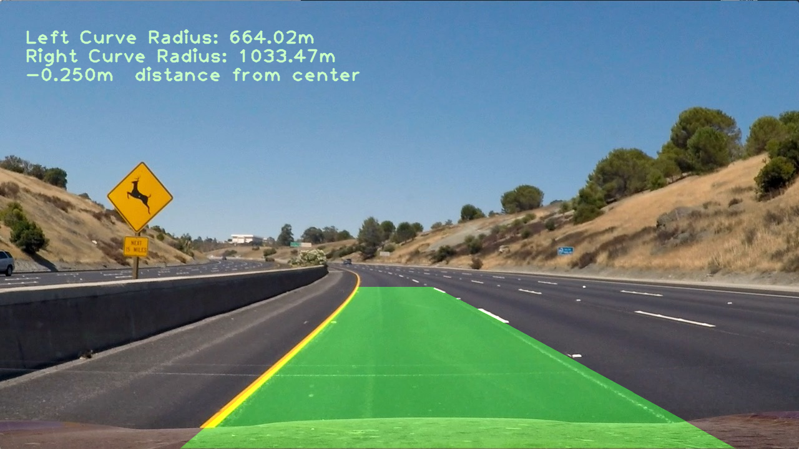

&nbsp;
### result: test3
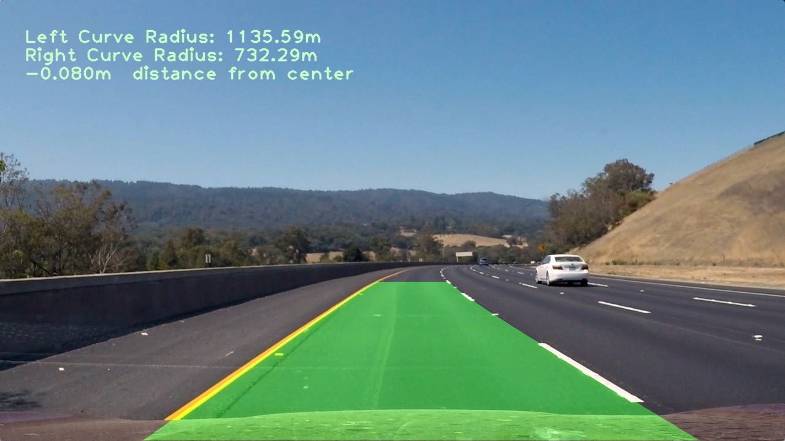

&nbsp;
### result: test4
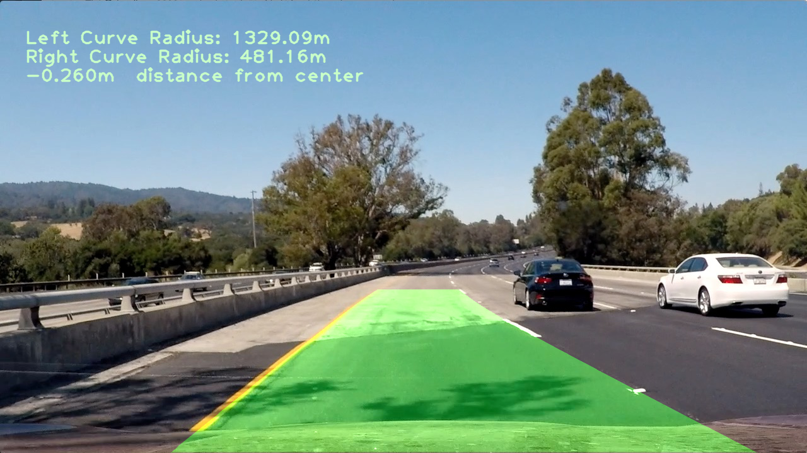

&nbsp;
### result: test5
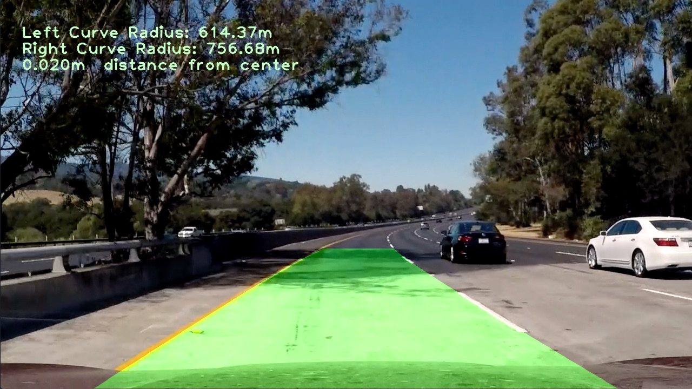

&nbsp;
### result: test6
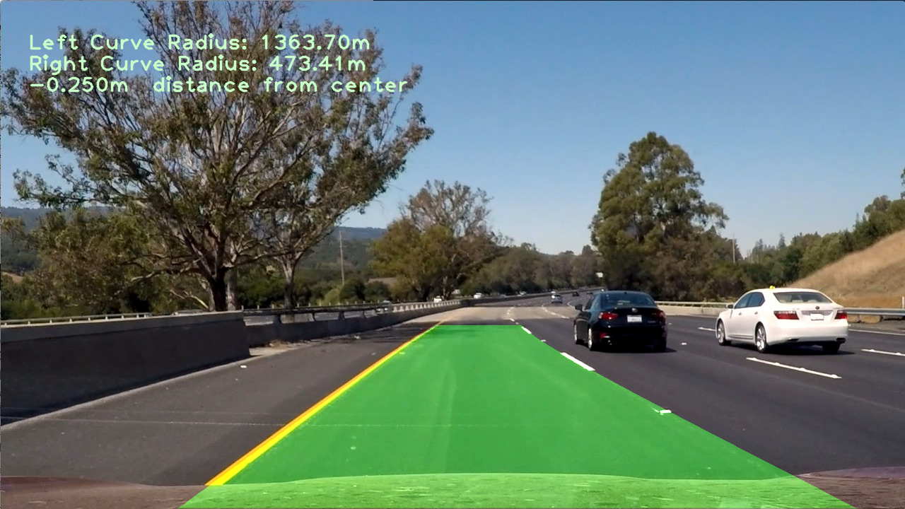

&nbsp;
### result: straight_lines1
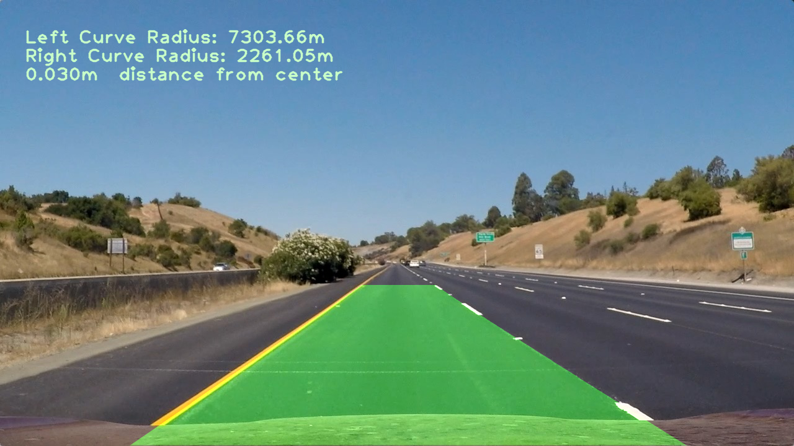

&nbsp;
### result: straight_lines2
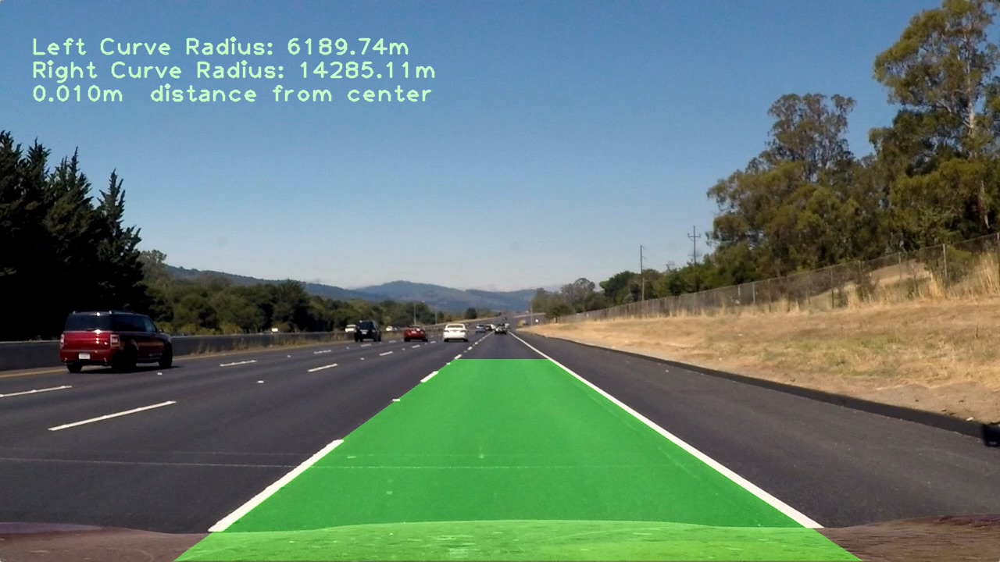


---

## Pipeline (video)


### Final Result 
### ( 0:00 - 0:25 sec )


### ( 0:25 - 0:50 sec )


Here's a [link to my video result](data/output_videos/project_video_solution.mp4)

---

### Discussion

#### 1. Briefly discuss any problems / issues you faced in your implementation of this project.  Where will your pipeline likely fail?  What could you do to make it more robust?

Here I'll talk about the approach I took, what techniques I used, what worked and why, where the pipeline might fail and how I might improve it if I were going to pursue this project further. 
